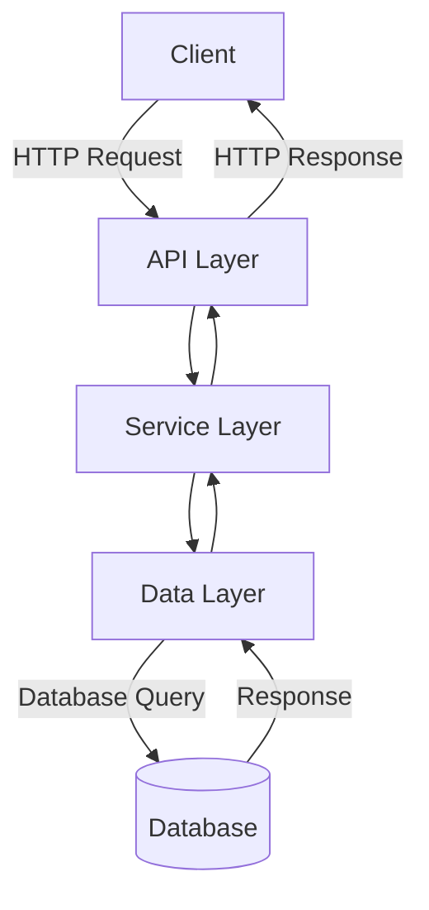
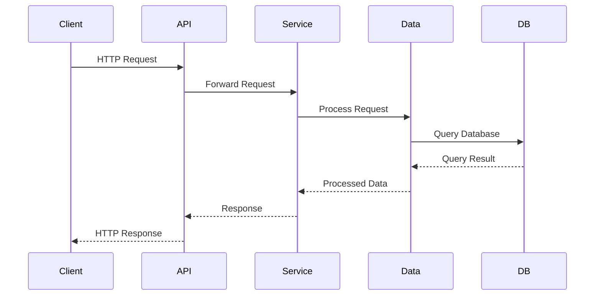

# Sample Node.js Application

This document provides an overview of a sample Node.js application, including its architecture and workflow. The application is designed to demonstrate best practices in Node.js development.

---

## Architecture

The application follows a modular architecture with the following components:

- **API Layer**: Handles HTTP requests and responses.
- **Service Layer**: Contains business logic.
- **Data Layer**: Manages database interactions.

### Architecture Diagram

---

## Workflow

The application workflow is as follows:

1. The client sends an HTTP request to the API layer.
2. The API layer forwards the request to the service layer.
3. The service layer processes the request and interacts with the data layer if needed.
4. The data layer queries the database and returns the result to the service layer.
5. The service layer sends the processed response back to the API layer.
6. The API layer sends the HTTP response to the client.

### Workflow Diagram

---

## References

- [Node.js Official Documentation](https://nodejs.org/en/docs/)
- [Mermaid.js Documentation](https://mermaid-js.github.io/mermaid/#/)
- [Best Practices for Node.js Development](https://github.com/goldbergyoni/nodebestpractices)
